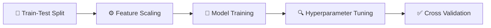

# Customer Churn and Retention Analysis

<div align="center">
  
</div>

<br>

**Author:** Dinh Thi Thanh Hang

## Project Overview

This project analyzes customer purchasing behavior and churn patterns using over 500,000 transaction records from a UK-based B2B online retailer specializing in gifts, decorations, and home accessories.

Using PySpark and Python, the project explores customer purchasing trends, identifies churn drivers, segments customers based on behavioral patterns, and develops a churn prediction framework to support retention strategies.

### Business Objectives

* Analyze revenue growth and sales performance
* Understand customer purchasing behavior
* Detect and profile churned customers
* Discover key drivers of customer churn
* Build a customer churn prediction model
* Recommend actionable retention strategies
---

## 🛠️ Tech Stack

### Data Processing


### Data Analysis


### Data Visualization


### Machine Learning


### Development Environment


## Dataset Overview

The dataset contains transactional records from a UK-based online retailer.

### Dataset Characteristics

| Metric             | Value                                |
| ------------------ | ------------------------------------ |
| Transactions       | 500,000+                             |
| Country Coverage   | Primarily United Kingdom             |
| Business Type      | B2B Online Retail                    |
| Product Categories | Gifts, Decorations, Home Accessories |
| Observation Period | Dec 2010 – Dec 2011                  |

### Key Fields

| Column      | Description               |
| ----------- | ------------------------- |
| InvoiceNo   | Transaction identifier    |
| StockCode   | Product identifier        |
| Description | Product description       |
| Quantity    | Number of units purchased |
| InvoiceDate | Transaction timestamp     |
| UnitPrice   | Product unit price        |
| CustomerID  | Customer identifier       |
| Country     | Customer location         |

---

# Executive Summary

### Revenue Growth

* Revenue experienced substantial growth from 2010 to 2011, increasing by **XX% YoY**.
* November 2011 recorded the highest monthly revenue, reaching **£XX**, representing **XX% MoM growth**.

### Key Growth Drivers

The strong sales performance in 2011 was primarily driven by:

* Expansion of the active customer base (+20% MoM)
* Higher average order values
* Increased purchases from high-value customer segments
* Customer preference shifts toward higher-priced products

### Customer Behavior

* A relatively small group of customers generated a disproportionately large share of total revenue.
* High-spending customers exhibited significantly higher purchase frequency and retention rates.
* Churned customers generally showed both low purchasing frequency and long inactivity periods.

---

# Methodology

## ✅ 1. Data Preparation

### ✅ 1.1 Data Cleaning

To ensure data quality and reliable customer analytics, the following preprocessing steps were performed:

#### ☑️ Data Type Validation

- [x] Verified schema and column data types
- [x] Converted `InvoiceDate` from string to timestamp format

#### ☑️ Missing Value Handling

- [x] Audited missing values across all columns
- [x] Removed **1,454** records with missing product descriptions
- [x] Replaced missing `CustomerID` values (**135,080 rows**) with `"Unknown"`

#### ☑️ Duplicate Removal

- [x] Identified and removed duplicate transaction records

#### ☑️ Invalid Transaction Filtering

- [x] Removed cancelled invoices (`InvoiceNo` beginning with `"C"`)
- [x] Removed negative quantities
- [x] Removed negative unit prices
- [x] Retained only valid purchase transactions

#### ☑️ Non-Product Transaction Removal

Excluded operational records such as:

- [x] POST
- [x] DOT
- [x] M
- [x] BANK CHARGES
- [x] AMAZONFEE
- [x] Gift Voucher Entries
- [x] Administrative Adjustment Codes

#### ☑️ Revenue Feature Creation

- [x] Created transaction-level revenue metric

```python
TotalPrice = Quantity * UnitPrice
```

- [x] Used for revenue analysis, customer value measurement, and RFM calculations

> ⚠️ **Important Note**
>
> Transactions with `InvoiceNo` starting with **"C"** indicate cancelled orders and were excluded from subsequent analysis.

---

### ✅ 1.2 Outlier Detection

Customer-level outliers were investigated before segmentation and churn modeling.

#### Analysis Checklist

- [x] Customer Spending Distribution
- [x] Purchase Frequency Distribution
- [x] Transaction Value Distribution

#### Methods Applied

- [x] Boxplot Analysis
- [x] Percentile Analysis
- [x] Distribution Visualization

#### Decision

- [x] Retained extreme customer values where appropriate
- [x] High-value customers were treated as genuine business behavior rather than data errors

---

### ✅ 1.3 Feature Engineering

Customer-level features were created to support segmentation and churn prediction.

#### ☑️ RFM Feature Construction

| Feature | Description |
|----------|-------------|
| 🕒 Recency | Days since most recent purchase |
| 🔄 Frequency | Number of unique orders |
| 💰 Monetary | Total customer spending |

#### ☑️ Churn Label Creation

Since the dataset does not contain an explicit churn indicator, a rule-based churn definition was developed.

##### Churn Definition

- [x] Recency > 108 days (70th percentile)
- [x] Frequency ≤ 4 orders (70th percentile)

| Label | Rule |
|--------|--------|
| 🔴 Churn = 1 | Recency > 108 AND Frequency ≤ 4 |
| 🟢 Churn = 0 | Otherwise |

> 🎯 The resulting churn label was used as the target variable for predictive modeling.

## 2. Exploratory Data Analysis

### 2.1 Analytical Framework
## 3. Churn Prediction

### 3.1 Problem Statement

Develop a classification model capable of predicting whether a customer is likely to churn based on historical purchasing behavior.

---

### 3.2 Feature Selection

---

### 3.3 Model Development

The model development process followed a standardized workflow to ensure fair comparison across all algorithms:



| Model | Category | Role in Analysis | Validation Strategy |
|---------|---------|---------|---------|
| Logistic Regression | Baseline Model | Establish a simple and interpretable benchmark for churn prediction | 3-Fold Cross Validation |
| Decision Tree | Baseline Model | Capture non-linear customer behaviors while maintaining model interpretability | 3-Fold Cross Validation |
| Random Forest | Ensemble Learning | Improve prediction performance through bagging and feature randomness | 3-Fold Cross Validation |
| XGBoost | Gradient Boosting | Capture complex interactions and optimize predictive accuracy | 3-Fold Cross Validation |
| LightGBM | Gradient Boosting | Provide efficient training and strong predictive performance on large datasets | 3-Fold Cross Validation |

### 3.4 Model Evaluation

### Ensemble Model 

# Repository Structure

```text
Customer-Churn-And-Retention-Analysis/
│
├── data/
│   ├── raw/
│   └── processed/
│
├── notebooks/
│   ├── EDA.ipynb
│   └── Churn_Modeling.ipynb
│
├── images/
│   ├── online_store.webp
│   ├── revenue_trend.png
│   ├── churn_distribution.png
│   └── rfm_segmentation.png
│
├── src/
│
├── README.md
│
└── requirements.txt
```
