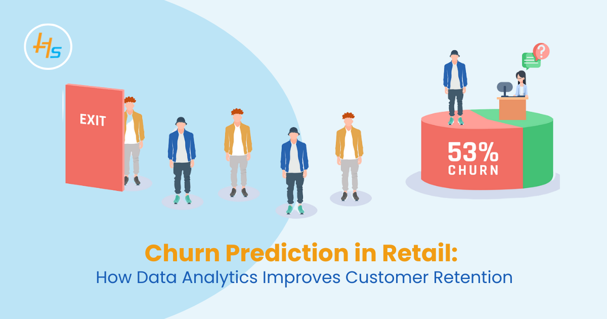
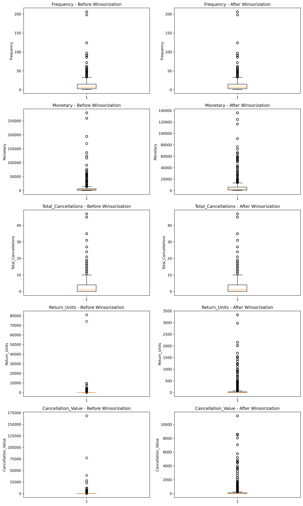
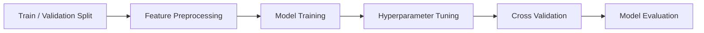

# Customer Churn and Retention Analysis

<div align="center">
  
</div>

<br>

**Author:** Dinh Thi Thanh Hang

## Project Overview

This project analyzes customer purchasing behavior, retention patterns, and churn risk using more than 500,000 transaction records from a UK-based online retailer specializing in gifts, decorations, and home accessories.

Using PySpark and Python, the project examines revenue and customer purchasing patterns, develops customer-level behavioral features, investigates potential churn drivers, and builds a churn prediction framework to support customer retention strategies.

### Business Objectives

- Analyze revenue growth and sales performance
- Understand customer purchasing behavior
- Identify and profile customers with high churn risk
- Investigate key behavioral factors associated with churn
- Develop and evaluate customer churn prediction models
- Translate analytical findings into actionable retention strategies

---

## Tech Stack

### Data Processing


### Data Analysis


### Data Visualization


### Machine Learning


### Development Environment


---

## Dataset Overview

The dataset contains transactional records from a UK-based online retailer between December 2010 and December 2011.

### Dataset Characteristics

| Metric | Value |
|---|---|
| Transaction Records | 500,000+ |
| Country Coverage | Primarily United Kingdom |
| Business Context | Online Retail |
| Product Categories | Gifts, Decorations, Home Accessories |
| Observation Period | Dec 2010 – Dec 2011 |

### Key Fields

| Column | Description |
|---|---|
| InvoiceNo | Transaction identifier |
| StockCode | Product identifier |
| Description | Product description |
| Quantity | Number of units purchased |
| InvoiceDate | Transaction timestamp |
| UnitPrice | Product unit price |
| CustomerID | Customer identifier |
| Country | Customer location |

---

# Executive Summary

> **Note:** This section will be updated with final results after completion of the exploratory analysis and churn modeling stages.

### Revenue Growth

- Revenue experienced substantial growth from 2010 to 2011, increasing by **XX% YoY**.
- November 2011 recorded the highest monthly revenue at **£XX**, representing **XX% MoM growth**.

### Key Growth Drivers

The strong sales performance observed during the analysis period was associated with:

- Expansion of the active customer base
- Changes in average order value
- Increased purchasing activity among high-value customers
- Shifts in customer product and purchasing behavior

### Customer Behavior

- Customer value was highly concentrated, with a relatively small group of customers accounting for a disproportionate share of purchasing activity.
- High-value customers generally exhibited greater purchasing frequency and stronger retention behavior.
- Customers classified as churned were characterized by longer inactivity periods and lower historical purchasing frequency.

---

# Methodology

## 1. Data Preparation

### 1.1 Data Cleaning

Data quality checks and preprocessing were performed using PySpark before customer-level feature engineering and modeling.

#### Data Type Validation

- Inspected the dataset schema and validated column data types.
- Converted `InvoiceDate` from string format to timestamp format.

#### Missing Value Handling

- Audited missing values across all variables.
- Removed **1,454 records** with missing product descriptions.
- Retained transactions without a `CustomerID` and classified them separately as anonymous customers for descriptive analysis.
- Customer-level churn analysis and modeling were restricted to identified customers because anonymous transactions could not be reliably linked across purchases.

#### Duplicate Removal

- Identified exact duplicate transaction records.
- Removed duplicate observations before downstream analysis.

#### Transaction Validation

Purchase and cancellation transactions were separated according to their business meaning.

Valid purchase transactions were defined using the following conditions:

- `InvoiceNo` does not begin with `"C"`
- `Quantity > 0`
- `UnitPrice > 0`

Cancelled transactions were identified primarily through `InvoiceNo` values beginning with `"C"`.

Rather than being discarded entirely, cancellation records were stored separately and later aggregated into customer-level cancellation and return features.

#### Non-Product Transaction Removal

Operational and administrative records that did not represent merchandise purchases were excluded from the main purchase dataset.

Examples include:

- `POST`
- `DOT`
- `M`
- `C2`
- `BANK CHARGES`
- `AMAZONFEE`
- Gift voucher entries
- Other administrative adjustment codes

This ensured that purchasing metrics represented actual product transactions rather than operational charges or accounting adjustments.

#### Revenue Feature Creation

A transaction-level revenue variable was constructed as:

```python
TotalPrice = Quantity * UnitPrice
```

`TotalPrice` was subsequently used for revenue analysis and customer-level monetary value calculations.

---

### 1.2 Customer-Level Feature Engineering

Following transaction cleaning, purchase behavior was aggregated at the customer level.

#### RFM Features

Three core behavioral features were constructed:

| Feature | Definition |
|---|---|
| Recency | Number of days since the customer's most recent successful purchase |
| Frequency | Number of distinct successful purchase invoices |
| Monetary | Total historical purchase value |

Cancelled transactions were excluded from the calculation of the core RFM variables to prevent returns and cancellations from distorting historical purchasing behavior.

#### Cancellation and Return Features

Cancellation behavior was aggregated separately at the customer level.

| Feature | Definition |
|---|---|
| Total_Cancellations | Number of distinct cancelled invoices |
| Return_Units | Total number of cancelled or returned units |
| Cancellation_Value | Estimated monetary value of cancelled transactions |
| Cancellation_Rate | Cancelled invoices relative to total purchase and cancellation activity |

This approach preserves cancellation behavior as a potential predictor of churn without directly incorporating negative transactions into RFM calculations.

---

### 1.3 Churn Definition

The original dataset does not provide an explicit churn indicator. Therefore, churn was operationalized using a rule-based proxy derived from observed purchasing behavior.

The current churn definition is:

```text
Churn = 1 if Recency > 108 days AND Frequency <= 4 orders
Churn = 0 otherwise
```

| Label | Definition |
|---|---|
| Churn = 1 | Recency > 108 days AND Frequency <= 4 |
| Churn = 0 | Otherwise |

The thresholds were selected based on the observed distributions of customer recency and purchasing frequency.

> **Methodological limitation:** The resulting target is a behavioral proxy rather than directly observed customer churn. Model performance should therefore be interpreted as the ability to predict this operational definition of churn rather than confirmed customer attrition.

---

### 1.4 Outlier Detection and Treatment

Customer purchasing behavior was strongly right-skewed, particularly for purchasing frequency, monetary value, and cancellation-related variables.

Extreme observations were first investigated to distinguish potential data-quality issues from legitimate customer behavior.

#### Detection Methods

Outliers and extreme values were assessed using:

- Distribution analysis
- Boxplots
- Percentile analysis
- Business-context validation

Many extreme observations were retained because unusually large order volumes and monetary values may represent genuine high-value or bulk-purchasing customers rather than data errors.

For descriptive and segmentation analysis, these customers were preserved to avoid removing economically important customer groups.

For predictive modeling, highly skewed numerical variables were winsorized at the **1st and 99th percentiles (P1–P99)**. Values below P1 or above P99 were capped at the respective percentile boundaries rather than removing the corresponding customers.

The following variables were winsorized:

- `Frequency`
- `Monetary`
- `Total_Cancellations`
- `Return_Units`
- `Cancellation_Value`

Original feature values were retained alongside the winsorized versions to support model comparison and preserve the original information for business analysis.

#### Winsorization Comparison

The figure below illustrates the distributions before and after percentile-based capping.

<div align="center">
  
</div>

*Figure 1. Distribution of selected numerical features before and after P1–P99 winsorization.*

Winsorization reduces the influence of extreme observations on scale-sensitive models while retaining high-value customers in the modeling population.

---

## 2. Exploratory Data Analysis

### 2.1 Analytical Framework

The exploratory analysis is structured around four major questions:

1. How did revenue and purchasing activity change over time?
2. Which customer groups contribute the greatest economic value?
3. How does purchasing behavior differ between retained and churned customers?
4. Which behavioral characteristics are most strongly associated with churn?

### 2.2 Revenue and Sales Performance

*To be completed.*

### 2.3 Customer Purchasing Behavior

*To be completed.*

### 2.4 Churn Analysis

*To be completed.*

### 2.5 Customer Segmentation

*To be completed.*

---

## 3. Churn Prediction

### 3.1 Problem Statement

The modeling objective is to develop a binary classification framework for estimating customer churn risk based on historical purchasing behavior.

Because the churn target is constructed from behavioral rules, particular attention is required to prevent target leakage when selecting predictor variables and defining observation windows.

---

### 3.2 Feature Selection

Candidate predictors are evaluated based on:

- Business relevance
- Predictive contribution
- Data availability at prediction time
- Multicollinearity
- Potential target leakage
- Stability across validation samples

*Final feature sets will be documented after feature selection experiments.*

---

### 3.3 Model Development

Multiple algorithms are evaluated to establish both interpretable baselines and stronger non-linear benchmarks.



| Model | Category | Role in Analysis | Validation Strategy |
|---|---|---|---|
| Logistic Regression | Linear Baseline | Establish an interpretable benchmark | 3-Fold Cross Validation |
| Decision Tree | Tree Baseline | Capture simple non-linear relationships | 3-Fold Cross Validation |
| Random Forest | Bagging Ensemble | Capture non-linear relationships while reducing individual-tree variance | 3-Fold Cross Validation |
| XGBoost | Gradient Boosting | Model complex interactions and improve predictive performance | 3-Fold Cross Validation |
| LightGBM | Gradient Boosting | Provide an efficient high-performance boosting benchmark | 3-Fold Cross Validation |

---

### 3.4 Model Evaluation

Model performance will be evaluated using classification metrics appropriate for churn prediction, including:

- Precision
- Recall
- F1-score
- ROC-AUC
- PR-AUC
- Confusion Matrix

Threshold selection will also be evaluated separately from model training to account for the trade-off between identifying churn-risk customers and generating unnecessary retention interventions.

---

### 3.5 Ensemble Modeling

An ensemble model will be evaluated if individual models demonstrate complementary predictive behavior.

The ensemble will only be retained if it provides meaningful improvement over the strongest standalone model on unseen validation data.

---

# Repository Structure

```text
Customer-Churn-And-Retention-Analysis/
│
├── data/
│   ├── raw/
│   ├── cleaned/
│   └── processed/
│
├── notebooks/
│   ├── 01_Data_Cleaning.ipynb
│   ├── 02_EDA_Feature_Engineering.ipynb
│   └── 03_Churn_Modeling.ipynb
│
├── images/
│   ├── online_store.webp
│   └── 01_winsorization_boxplot_comparison.png
│
├── src/
│
├── README.md
│
└── requirements.txt
```